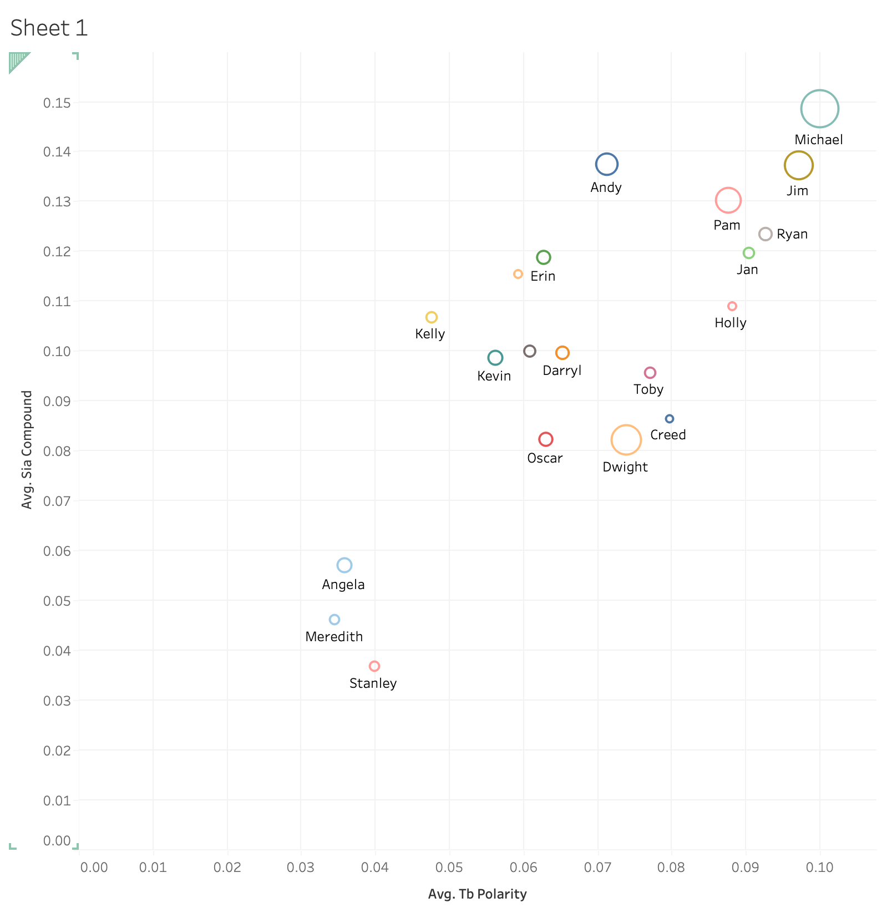

# The office

## Project Description
This project contains an SQL database of all the lines from the popular TV series "The Office". The data was downloaded from Kaggle and cleaned using Jupyter notebooks before being loaded into an SQL database. The purpose of this project is to provide a platform for data analysis and visualization for fans of the show who are interested in exploring the characters, dialogues, and scenes.

In addition to basic queries like finding the most talkative characters, this project also includes sentiment analysis of the lines spoken in each episode. The sentiment analysis was performed using the TextBlob library in Python and includes the following measures: polarity, subjectivity, and compound score. The compound score is a metric that combines the polarity and subjectivity to give an overall sentiment score between -1 (negative) and 1 (positive).

The sentiment analysis was used to identify which seasons, actors, and episodes had the highest sentiment compound score. This information can be useful for understanding the emotional tone of the show and how it evolves over time. For example, we found that season 7 had the highest sentiment compound score, while the character Michael Scott had the highest average sentiment compound score across all his lines. We also found that the episode "Goodbye, Michael" had the highest sentiment compound score, which is not surprising given its emotional significance in the series.

## Technologies Used
The following technologies were used in the creation of this project:

Python
Jupyter Notebooks
SQL
Tableau

## Getting Started
To get started with this project, you will need to have an SQL database management tool installed on your machine. You can use software like MySQL, PostgreSQL, or SQLite to interact with the database. Once you have the database management tool installed, you can load the database file provided in this repository and start running queries to explore the data. The sentiment analysis code is also provided in the sentiment_analysis.ipynb Jupyter notebook.

## Data Description
The database contains a table of all the lines from "The Office" series. The table includes the following columns:

Season: the season number
Episode: the episode number
Actor: the character who spoke the line
Line: the text of the line spoken

## Queries
To demonstrate the capabilities of this database, several sample queries have been provided in the sql_queries file. These queries include, calculating the sentiment of each episode, identifying the top 10 most talkative characters and another query was made to find out how many time Michael said his iconic phrase: "that's what she said". 

## Visualizations
The img file contains several visualizations created using Tableau. Please visit this page to get access to the interactive visualizations: https://public.tableau.com/app/profile/santiago.aguilar5765/viz/TheofficeAnalysis_16781781282580/Story1?publish=yes

These visualizations include a breakdown of the characters' dialogue by season, a sentiment analysis of each episode, the seasons and episodes with the highes compound sentiment. Interestingly the episode of the whole series with the highest compound sentiment is "Valantines Day". And the season with the highest sentiment  is season 1, although it is said to be worst one. 

## Conclusion
Overall, this project provides a comprehensive database of all the lines spoken in "The Office" series and demonstrates the power of SQL for data analysis and visualization. The sentiment analysis adds another layer of insight into the emotional tone of the show and how it evolves over time. We hope that fans of the show will find this project useful and enjoyable.